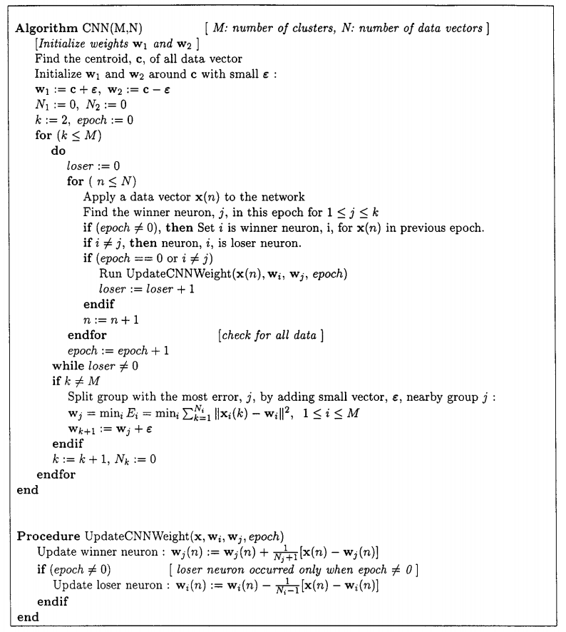
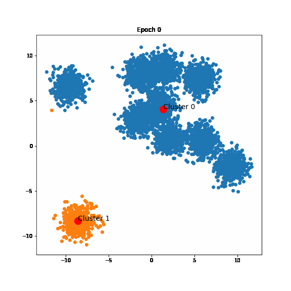

# Centroid Neural Networks for Unsupervised Competitive Learning

[](https://ieeexplore.ieee.org/document/839021)
[](https://towardsai.net/p/l/centroid-neural-network-an-efficient-and-stable-clustering-algorithm)

Implementation of the Centroid Neural Network algorithm.

## Introduction

### Algorithm

<p align="center">

</p>

### Clustering Process

<p align="center">

</p>

## Demo

### Centroid Neural Network

```
python test_centnn.py
```

### G - Centroid Neural Network

(to be updated)

## Citation

```bibtex
@article{park2000centroid,
  title={Centroid neural network for unsupervised competitive learning},
  author={Park, Dong-Chul},
  journal={IEEE Transactions on Neural Networks},
  volume={11},
  number={2},
  pages={520--528},
  year={2000},
  publisher={IEEE}
}
```

Have fun!

LA Tran
