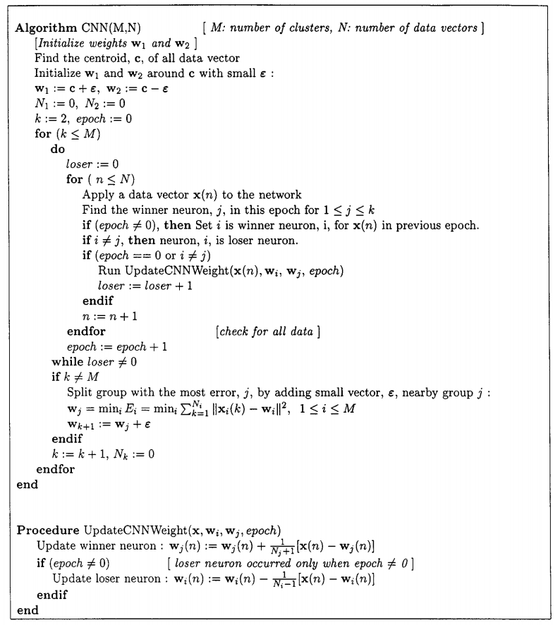
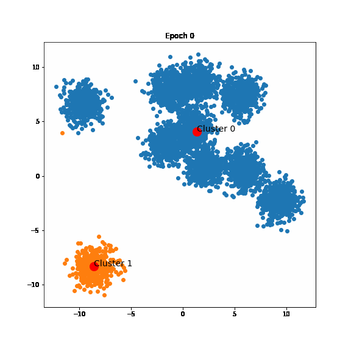

# CentNN & Variants

CentNN:
[](https://ieeexplore.ieee.org/document/839021)
[](https://towardsai.net/p/l/centroid-neural-network-an-efficient-and-stable-clustering-algorithm) | 
FastCentNN:
[](https://arxiv.org/)

The implementations of different variants of the Centroid Neural Network (CentNN) clustering algorithm.

## Introduction

### Original CentNN

<p align="center">

</p>

### Process Illustration

<p align="center">

</p>

## Variants

### ⭐ CentNN (Original)
```bash
python test_CentNN.py
```

#### Citation

```bibtex
@article{park2000centroid,
  title={Centroid neural network for unsupervised competitive learning},
  author={Park, Dong-Chul},
  journal={IEEE Transactions on Neural Networks},
  volume={11},
  number={2},
  pages={520--528},
  year={2000},
  publisher={IEEE}
}
```

### ⚡ FastCentNN (Accelerated)
```bash
python test_CentNN_vs_FastCentNN.py
```

(to be updated)

#### Citation

```bibtex
@article{tran2026fastcentnn,
  title={FastCentNN: Accelerating Centroid Neural Network with Entropy Proxy},
  author={Tran, Le-Anh},
  journal={arXiv preprint arXiv:2607.13613},
  year={2026}
}
```

Have fun!

LA Tran
